# Podium - Data Flow Diagram

## System Architecture Overview

This document outlines how data flows through the Podium attendance tracking system, illustrating how all components interact with each other.

```mermaid
graph TB
    subgraph Client["Client Layer (Browser)"]
        Login["Login Page<br/>index.hbs"]
        Register["Register Page<br/>register.hbs"]
        Dashboard["Student Dashboard<br/>dashboard.hbs"]
        AdminLogin["Admin Login Page<br/>adminLogin.hbs"]
        AdminPanel["Admin Dashboard<br/>adminDashboard.hbs"]
        CheckIn["Check Attendance<br/>checkAttendance.hbs"]
        Checkout["Checkout Page<br/>checkout.hbs"]
        EditStudent["Edit Student<br/>editStudent.hbs"]
        AttendanceHistory["Attendance History<br/>attendanceHistory.hbs"]
    end

    subgraph Frontend["Frontend JavaScript Layer"]
        fLogin["fLogin.js<br/>(Login Logic)"]
        fRegister["fRegister.js<br/>(Register Logic)"]
        fDashboard["fDashboard.js<br/>(Dashboard Logic)"]
        fAdminLogin["fAdminLogin.js<br/>(Admin Login Logic)"]
        fCheckAttendance["fCheckAttendance.js<br/>(Attendance Logic)"]
        fCheckout["fCheckout.js<br/>(Checkout Logic)"]
        fEditStudent["fEditStudent.js<br/>(Edit Logic)"]
        fAttendanceHistory["fAttendanceHistory.js<br/>(History Logic)"]
    end

    subgraph Backend["Backend Layer (Express Routes)"]
        bIndex["bIndex/Login<br/>routes/index.js"]
        bRegister["Register<br/>routes/bRegister.js"]
        bSignin["Signin<br/>routes/bSignin.js"]
        bDashboard["Dashboard<br/>routes/bDashboard.js"]
        bAdminLogin["Admin Login<br/>routes/bAdminLogin.js"]
        bAdminDash["Admin Dashboard<br/>routes/bAdminDashboard.js"]
        bCheckAtt["Check Attendance<br/>routes/bCheckAttendance.js"]
        bCheckout["Checkout<br/>routes/bCheckout.js"]
        bEditStudent["Edit Student<br/>routes/bEditStudent.js"]
        bManageStudents["Manage Students<br/>routes/bManageStudents.js"]
        bCheckSignout["Check Signout<br/>routes/bCheckSignout.js"]
        bAttendanceHistory["Attendance History<br/>routes/bAttendanceHistory.js"]
    end

    subgraph Database["Database Layer (Supabase)"]
        Users["Table: users<br/>(id, full_name, password,<br/>is_auth, is_admin)"]
        Students["Table: students<br/>(id, full_name, session,<br/>class, student_number)"]
        Attendance["Table: attendance<br/>(id, student_id,<br/>check_in_time, check_out_time)"]
        Sessions["Table: sessions<br/>(sid, user_id, data,<br/>expires)"]
    end

    subgraph Config["Configuration Layer"]
        Supabase["config/supabase.js<br/>(Supabase Client)"]
        SessionStore["config/SupabaseSessionStore.js<br/>(Session Management)"]
        DBModule["database/db.js<br/>(Data Access Layer)"]
    end

    subgraph APIs["External APIs"]
        Email["Email Service<br/>(Nodemailer)"]
        ArchiveJob["Archive Attendance Job<br/>api/archive-attendance.js"]
        ResetJob["Reset Daily Attendance<br/>api/reset-daily-attendance.js"]
        MorningEmail["Morning Email Job<br/>api/send-email-morning.js"]
        RegularEmail["Send Email<br/>api/send-email.js"]
    end

    subgraph Server["Express Server<br/>server.js"]
        AppConfig["App Configuration<br/>- Session Setup<br/>- View Engine: HBS<br/>- Static Files<br/>- Middleware"]
    end

    %% Client to Frontend connections
    Login --> fLogin
    Register --> fRegister
    Dashboard --> fDashboard
    AdminLogin --> fAdminLogin
    CheckIn --> fCheckAttendance
    Checkout --> fCheckout
    EditStudent --> fEditStudent
    AdminPanel --> fAdminLogin
    AttendanceHistory --> fAttendanceHistory

    %% Frontend to Backend connections
    fLogin --> bIndex
    fRegister --> bRegister
    fDashboard --> bDashboard
    fAdminLogin --> bAdminLogin
    fCheckAttendance --> bCheckAtt
    fCheckout --> bCheckout
    fEditStudent --> bEditStudent
    fAdminLogin --> bAdminDash
    fAttendanceHistory --> bAttendanceHistory

    %% Backend to Database Layer connections
    bIndex --> DBModule
    bRegister --> DBModule
    bSignin --> DBModule
    bDashboard --> DBModule
    bAdminLogin --> DBModule
    bAdminDash --> DBModule
    bCheckAtt --> DBModule
    bCheckout --> DBModule
    bEditStudent --> DBModule
    bManageStudents --> DBModule
    bCheckSignout --> DBModule
    bAttendanceHistory --> DBModule

    %% Database Access Layer to Config
    DBModule --> Supabase
    DBModule --> SessionStore

    %% Config to Database connection
    Supabase --> Users
    Supabase --> Students
    Supabase --> Attendance
    SessionStore --> Sessions

    %% Server configuration
    AppConfig --> SessionStore
    AppConfig --> Supabase
    AppConfig --> bIndex
    AppConfig --> bRegister
    AppConfig --> bSignin
    AppConfig --> bDashboard

    %% Email and Jobs
    bCheckout --> Email
    ArchiveJob --> Attendance
    ResetJob --> Attendance
    MorningEmail --> Email
    RegularEmail --> Email
```



## Data Flow Sequence

### 1. **User Registration Flow**
```
User Input (register.hbs)
    ↓
fRegister.js (Client-side validation)
    ↓
POST /register (bRegister.js)
    ↓
usersDB.register() (db.js)
    ↓
Supabase: INSERT into users table
    ↓
Response: Registration success or error
```

### 2. **User Login Flow**
```
User Input (index.hbs)
    ↓
fLogin.js (Client-side validation)
    ↓
POST / (routes/index.js)
    ↓
usersDB.login() (db.js)
    ↓
Supabase: Query users table
    ↓
Session Storage (SupabaseSessionStore)
    ↓
Redirect to Dashboard or Signin Page
```

### 3. **Attendance Check-In Flow**
```
Student Views checkAttendance.hbs
    ↓
fCheckAttendance.js (Loads students via GET)
    ↓
GET /check-attendance (bCheckAttendance.js)
    ↓
studentsDB.getAllStudents() (db.js)
    ↓
Supabase: Query students table
    ↓
Render page with all students
    ↓
Teacher marks attendance
    ↓
Frontend processes submission
```

### 4. **Student Dashboard & Checkout Flow**
```
GET /dashboard/:studentId (bDashboard.js)
    ↓
Verify session & fetch student details
    ↓
studentsDB.getStudentsById() (db.js)
    ↓
Render dashboard.hbs with student data
    ↓
Student clicks checkout
    ↓
POST /dashboard/checkout (bDashboard.js)
    ↓
checkoutDB.addCheckout() (db.js)
    ↓
Supabase: INSERT into attendance table
    ↓
Send email confirmation (Nodemailer)
    ↓
Return success response
```

### 5. **Admin Features Flow**
```
Admin Login (adminLogin.hbs)
    ↓
POST /admin-login (bAdminLogin.js)
    ↓
Verify admin credentials
    ↓
Load Admin Dashboard (adminDashboard.hbs)
    ↓
Admin can:
    - Edit Students (bEditStudent.js)
    - Manage Students (bManageStudents.js)
    - View Attendance History (bAttendanceHistory.js)
    - Check Signouts (bCheckSignout.js)
```

### 6. **Scheduled Jobs Flow**
```
Daily at scheduled time:
    ├─ send-email-morning.js
    │   ↓ Sends morning attendance reminder emails
    │
    ├─ reset-daily-attendance.js
    │   ↓ Resets attendance status for new day
    │
    ├─ archive-attendance.js
    │   ↓ Archives old attendance records
    │
    └─ send-email.js
        ↓ Sends notification emails
        ↓
        Nodemailer (Email Service)
```

## Database Schema Overview

### Users Table
- `id` (Primary Key)
- `full_name` (string)
- `password` (string - should be hashed)
- `is_auth` (boolean)
- `is_admin` (boolean)

### Students Table
- `id` (Primary Key)
- `full_name` (string)
- `session` (string - AM/PM)
- `class` (string)
- `student_number` (integer)

### Attendance Table
- `id` (Primary Key)
- `student_id` (Foreign Key)
- `check_in_time` (timestamp)
- `check_out_time` (timestamp)
- `destination` (string - where student is going)

### Sessions Table (Managed by Supabase)
- `sid` (Session ID)
- `user_id` (User identifier)
- `data` (Session data)
- `expires` (Expiration time)

## Key Integration Points

1. **Session Management**: Uses Supabase Session Store for persistent user sessions
2. **Email Notifications**: Nodemailer sends checkout confirmations and reminders
3. **Static Files**: CSS and JS served from `/public` directory
4. **View Engine**: Handlebars (HBS) for server-side template rendering
5. **Environment Variables**: Supabase credentials and session secrets stored in .env

## Technology Stack

- **Backend**: Node.js + Express.js
- **Frontend**: Vanilla JavaScript + HTML + CSS
- **Database**: Supabase (PostgreSQL)
- **Session Store**: Custom Supabase Session Store
- **Email**: Nodemailer
- **Task Scheduling**: Cron jobs (configured via api/ routes)
- **Template Engine**: Handlebars (HBS)
